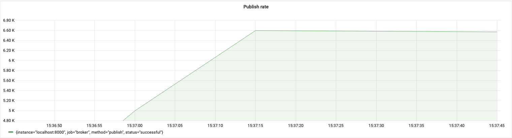
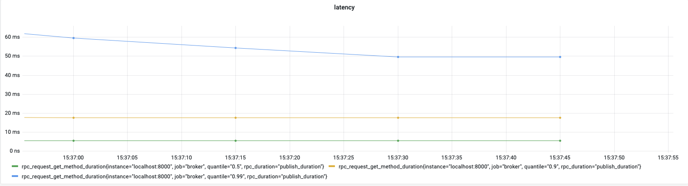

# Message Broker
In Bale Messenger’s golang backend trainee program, as our final project, we were tasked to implement a gRPC message 
broker. In this project I had hands-on experience working with:
 - Channels / Lock / Mutex
 - grpc/Protobuf
 - Postgres & SQL
 - Load testing
 - Unit testing
 - Load Testing using K6 and custom written golang client
 - Tracing using Jaeger
 - Performance scrapping using prometheus 
 - Performance monitoring using custom-built Grafana dashboards
 - Global and local rate limiting using envoy
 - Containerization and container orchestration using Kubernetes
 - Performance optimization using insert batching and in-memory caching

## Performance Report 
We had several load testing and stress testing phases on broker's publish functionality using K6 and custom-built 
golang clients. 

### rate

### latency

